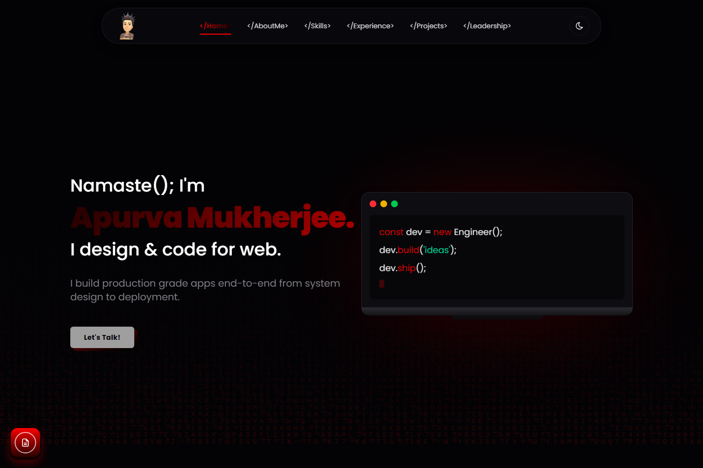
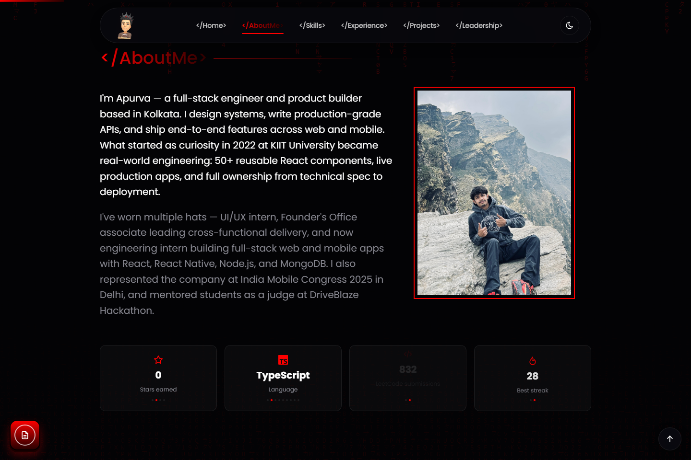
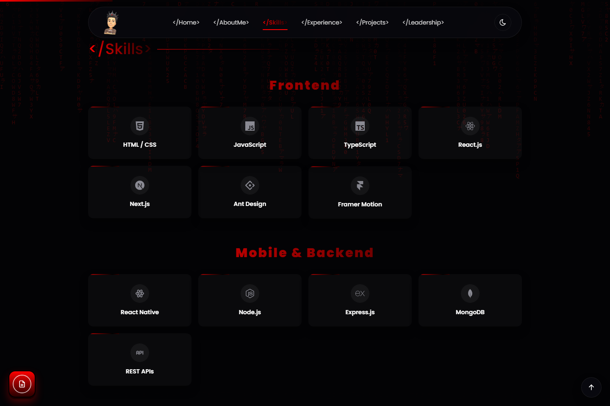
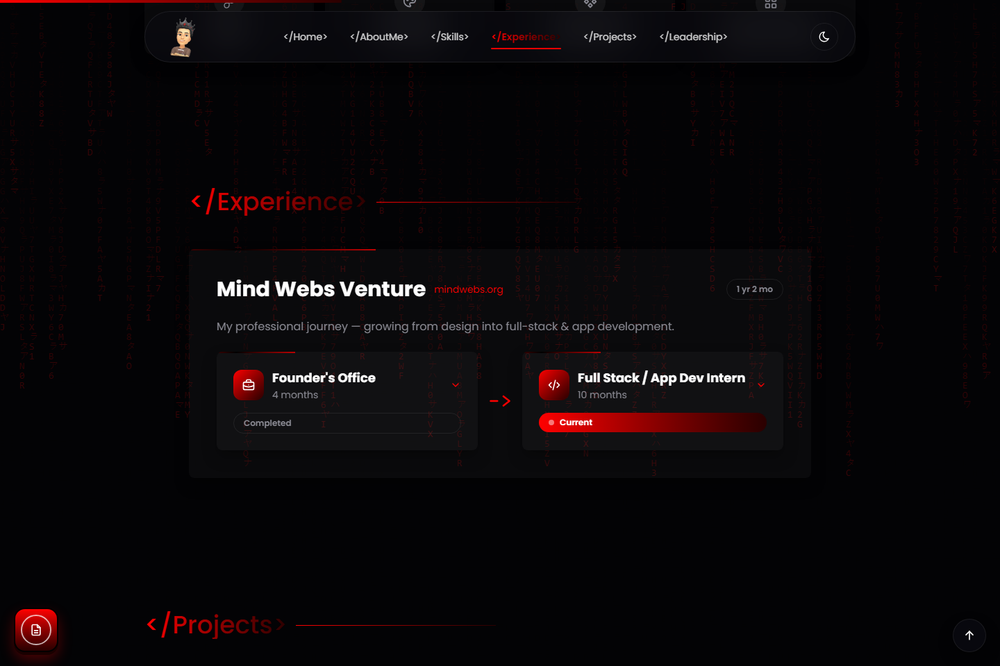
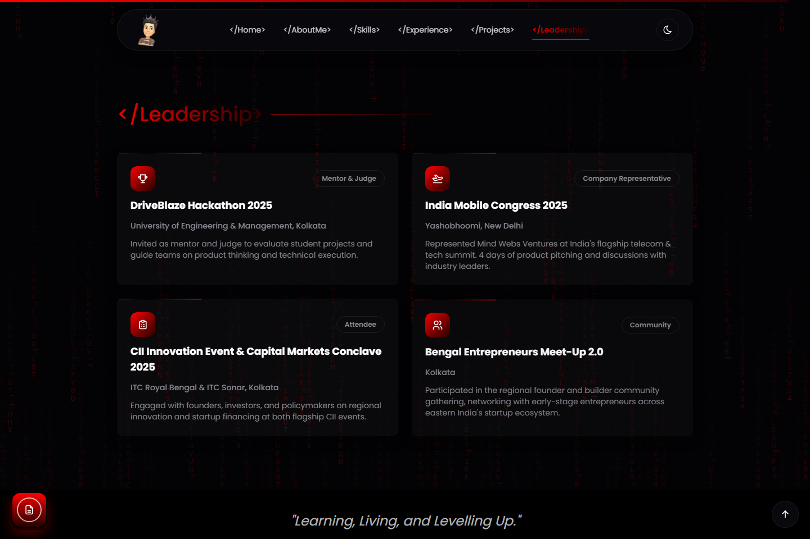
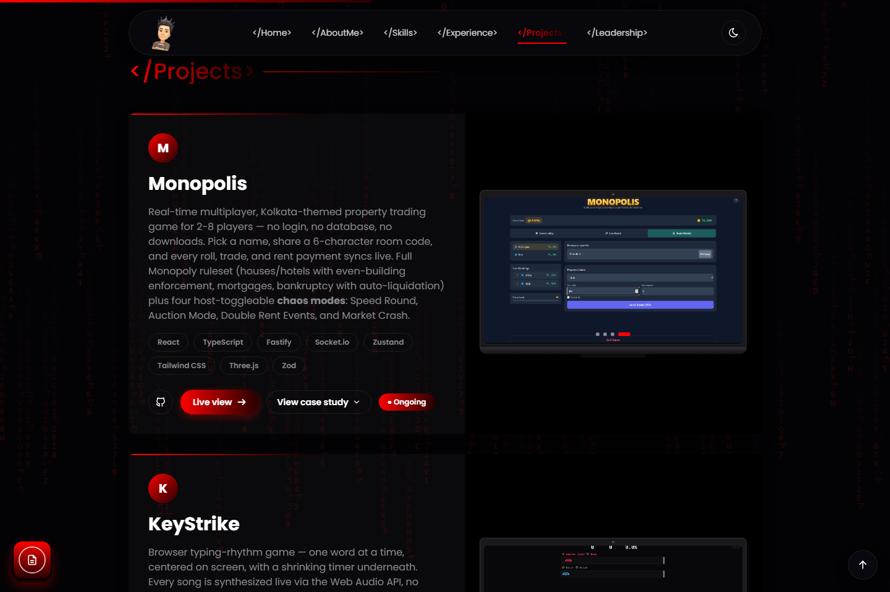

<div align="center">

# Apurva Mukherjee — Portfolio

### `</Namaste();>`

A personal site that looks like a terminal and moves like a product. Black-and-red
hacker aesthetic, a live command palette, a Matrix-rain backdrop, and a project
gallery with real case studies behind it — no template, no theme picker, all custom.

[](https://react.dev)
[](https://vitejs.dev)
[](https://tailwindcss.com)
[](https://www.framer.com/motion/)

**[apurva.space →](https://apurva.space)**

</div>

---



Every section is built to feel like part of one machine instead of a stack of
landing-page blocks: the nav bar reads like import tags (`</Home>`, `</Projects>`),
the hero renders as a fake code editor, and a decaying stream of random characters
runs behind everything at low opacity — on a canvas, GPU-composited, never touching
layout or scroll performance.

## Features

### A terminal that answers to a keyboard shortcut
- **Command palette** (`⌘K` / `Ctrl+K`) — fuzzy-search every nav link, copy the email
  address, open the résumé, or flip the theme without touching the mouse.
- **Theme toggle** — full dark/light palette swap, not just an inverted filter.
- **Keyboard-first navigation** throughout: focus states, escape-to-close, arrow-key
  list traversal in the palette.

### A projects section that isn't just a grid of links
- Every project card carries a **problem → approach → impact** case study, a live
  image carousel, real tech-stack tags, and links to the live deploy and the repo —
  data-driven from a single typed file, no copy-pasted JSX per project.
- Tilt-on-hover cards with a gradient sweep that tracks the cursor.

### Built like a product, not a brochure
- **Live GitHub stats** pulled straight from the API — stars, top language, streaks —
  instead of hand-typed numbers that go stale.
- A scroll-spy nav bar, a floating "back to top," a floating résumé button, and a
  preloader that actually reflects load state.
- Fully responsive down to a real mobile menu, not a squeezed desktop layout.

### Fast on purpose
- Rare or heavy UI (the command palette, decorative extras) is **code-split** and
  loaded on demand instead of shipped in the critical bundle.
- The cursor-glow effect runs GPU-only — no layout thrash, no main-thread cost per
  frame.
- Respects `prefers-reduced-motion` everywhere animation shows up.

## A look around

| | |
|---|---|
|  |  |
|  |  |



## Stack

| Layer | Choice |
|---|---|
| UI | React 19 + TypeScript, Vite 8 |
| Styling | Tailwind CSS v4 (CSS-first config, zero `tailwind.config.js`) |
| Motion | Framer Motion — scroll reveals, hover tilt, page transitions |
| Icons | `react-icons` (Simple Icons + Tabler) — no emoji, no icon-font CDN |

## Structure

```
src/
  components/
    layout/     Navbar, mobile menu, footer, preloader, floating buttons
    shared/     Command palette, Matrix rain, cursor spotlight, tilt cards, ...
    sections/   One component per landing-page section (Hero, Skills, Projects, ...)
  data/         Site content as typed data — skills, projects, experience, commands
  hooks/        useTheme, useReducedMotion, useScrollSpy, useMagnetic, ...
  lib/motion.ts Shared Framer Motion variants
public/
  assets/       Images, logos, project screenshots, résumé PDF
```

Everything on the page — skills, timeline, projects, leadership, social links — lives
in `src/data/*.ts` as plain typed objects. The components just render what's there.

## Run it locally

```bash
npm install
npm run dev      # http://localhost:5173
npm run build    # type-check + production build into dist/
npm run preview  # serve the production build locally
```

## Deployment

Pushing to `main` builds the site and publishes `dist/` to GitHub Pages via GitHub
Actions, served on a custom domain (`apurva.space`) through DNS-only `A`/`CNAME`
records — no proxy sitting in front of it.

---

<div align="center">Made by Apurva</div>
